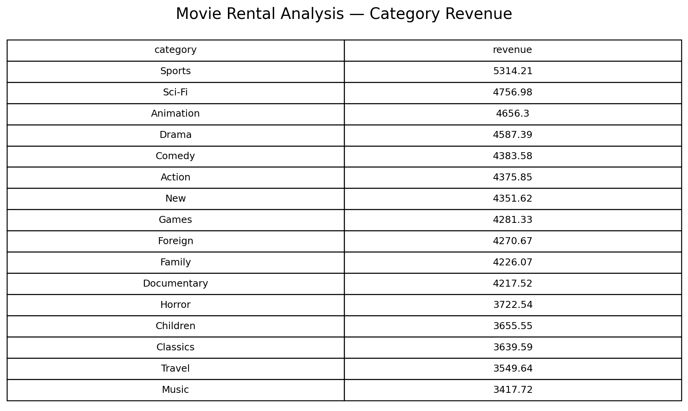
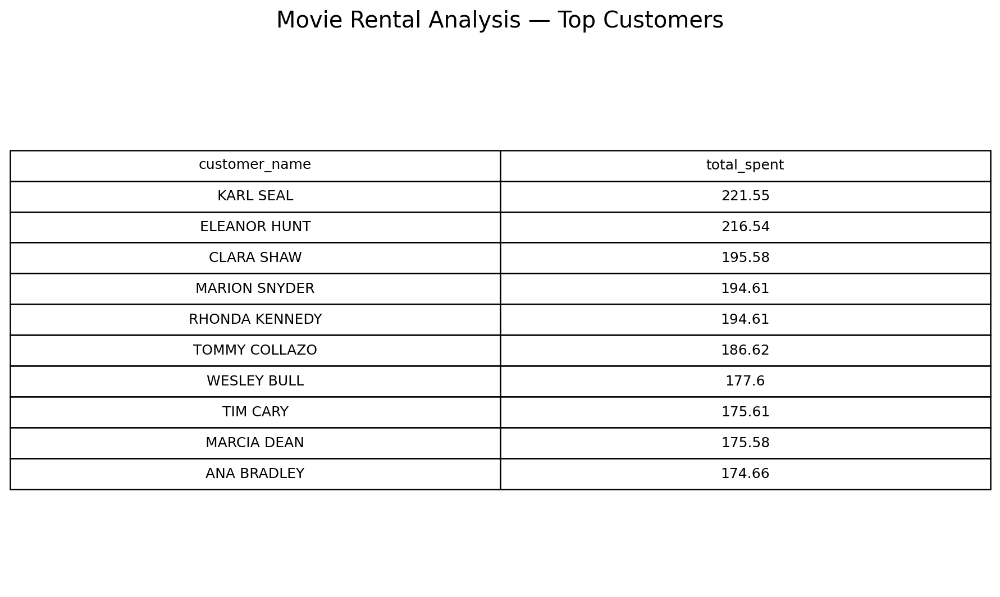
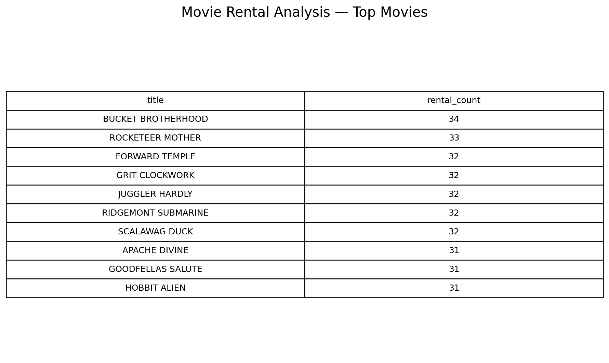
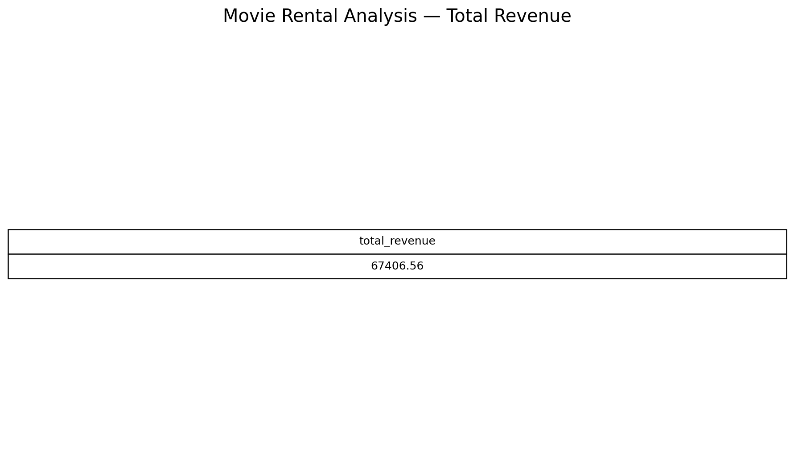

# 🎬 Movie Rental Analysis

## 📌 Project Overview

This project analyzes a movie rental business using a SQLite database and SQL queries.

The analysis focuses on customer behavior, movie popularity, rental revenue, categories, stores, ratings, and rental trends.

## 🛠️ Tools & Technologies

- SQLite
- SQL
- GitHub
- DB Browser for SQLite / SQLite-compatible tools

## 📂 Project Structure

```text
Movie-Rental-Analysis/
├── MOVIE RENTAL ANALYSIS.db
├── SQL/
│   └── movie_rental_analysis.sql
├── screenshots/
└── README.md
```

## 📊 Database Overview

The database contains 16 tables, including:

- `film`
- `customer`
- `payment`
- `rentat`
- `inventory`
- `category`
- `actor`
- `film_actor`
- `film_category`
- `store`
- `staff`
- `address`
- `city`
- `country (1)`
- `language`
- `film_text`

Key data volumes include:

- 1,000 films
- 599 customers
- 16,044 rentals
- 16,044 payments
- 4,581 inventory records
- 200 actors
- 16 categories

## 🔍 Business Questions Answered

1. What is the total rental revenue?
2. How many rentals were made?
3. Which customers spent the most?
4. Which movies were rented the most?
5. Which categories generated the most revenue?
6. Which categories had the most rentals?
7. How did the two stores perform?
8. How do rentals and revenue vary by movie rating?
9. What is the average rental duration by rating?
10. Which movies are the longest?
11. Which movies have the highest rental rates?
12. How does revenue change month by month?
13. How do rental volumes change month by month?
14. Which movies were never rented?
15. Which actors appear in the most movies?
16. What is the average time taken to return a rental?
17. How many customers are active vs inactive?
18. Which cities generated the most rentals?

## 💡 Sample Findings

Based on the current database:

- Total rental revenue: **$67,406.56**
- Total rentals: **16,044**
- Average rental return time: **5.03 days**
- The two stores generated very similar revenue.
- Sports was the highest-revenue category in the analysis.
- `BUCKET BROTHERHOOD` was the most-rented movie in the database.

## ▶️ How to Run the Project

### Option 1: DB Browser for SQLite

1. Install DB Browser for SQLite.
2. Open `MOVIE RENTAL ANALYSIS.db`.
3. Go to **Execute SQL**.
4. Open `SQL/movie_rental_analysis.sql`.
5. Run each query and review the results.

### Option 2: SQLite

Open the database with any SQLite-compatible command-line tool and execute the SQL file.

## 🎯 Skills Demonstrated

- SQL querying
- SELECT statements
- JOINs
- GROUP BY
- ORDER BY
- Aggregate functions
- Date functions
- Subquery/relational analysis
- Business data analysis
- Data interpretation

## 👩‍💻 Author

**Moksha Manisha**

This project was created as a SQL data analytics portfolio project.
## Screenshots

### 1. Category Revenue


### 2. Top Customers


### 3. Top Movies


### 4. Total Revenue

